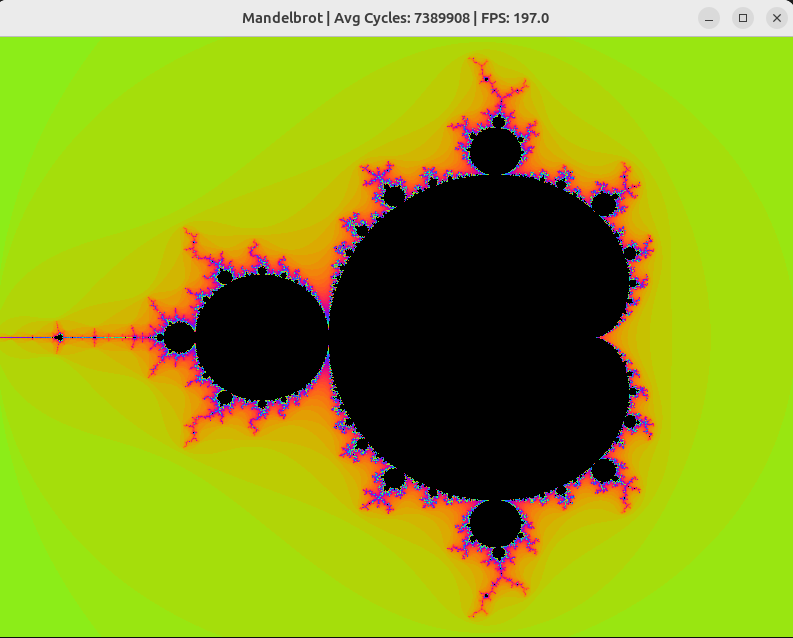
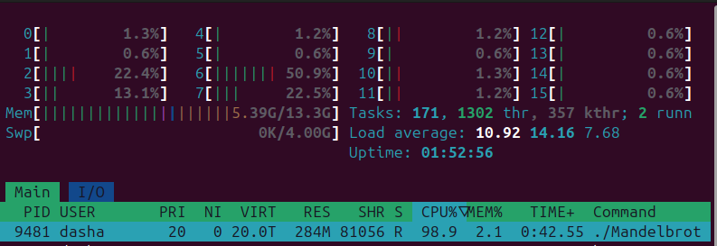
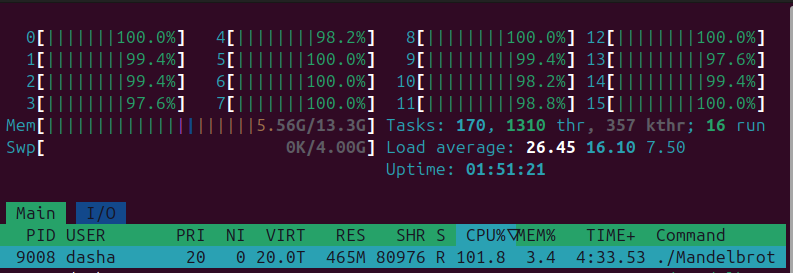

# Mandelbrot
 The program renders the Mandelbrot fractal with zoom capability and performance monitoring in CPU cycles


## Optimization technologies
The final version of the project implements the following levels of computing acceleration:

* ### SIMD Parallelism (AVX2):
     Vector processor instructions are used. Instead of counting each point individually, the algorithm processes 8 pixels simultaneously, working with single-precision (32-bit) floating-point values using 256-bit registers.
* ### Hardware Acceleration (FMA): 
    Fused Multiply-Add instructions are used for the basic fractal formula.
* ### Multi-core Rendering (OpenMP):
     Calculations are distributed to all available processor cores. The frame is split into parts that are rendered in parallel, which gives an approximately linear increase in speed based on the number of cores.
* ### Low-level Profiling: 
    To accurately measure performance, RDTSC/RDTSCP support is integrated into the code, which allows you to track the rendering time in processor cycles.

## Visualization

* <u><span style="font-size: 1.1em; font-weight: bold;">Graphical output</span></u> is implemented through the **[SDL2](https://www.libsdl.org/)** library.
* <u><span style="font-size: 1.1em; font-weight: bold;">Dynamic coloring</span></u> based on trigonometric functions is used to create smooth color transitions.

## Launching the program

There is a Makefile to save time and run the program with AVX instructions quickly. All you need to do is write the following command on the command line:
 ```
 $ make
 ```
 The file "Mandelbrot" has been created.

To run the program on Linux, write in the command line 
```
 $ ./Mandelbrot
 ```
and enjoy
 ( ͡° ͜ʖ ͡°).

## Comparison of FPS indicators of two versions of the program

### 1. The primitive version without [optimization technologies](#optimization-technologies) 

<p align="center">
  
  <br>
  <em>Performance of the <b>first version</b> of the program</em>
</p>

<p align="center">
  
  <br>
  <em><b>Single-threaded</b> execution of the Mandelbrot algorithm</em>
</p>

### 2. Final version with all [optimizations](#optimization-technologies)

<p align="center">
  
  <br>
  <em>Performance of the <b>final version</b> of the program</em>
</p>

<p align="center">
  
  <br>
  <em><b>Multi-threaded</b> execution of the Mandelbrot algorithm</em>
</p>

> The [htop](https://htop.dev/) program was used to monitor the load on each processor core in real time.

 
### 🚀 As a result, we are seeing productivity gains of **more than 13 times!**
